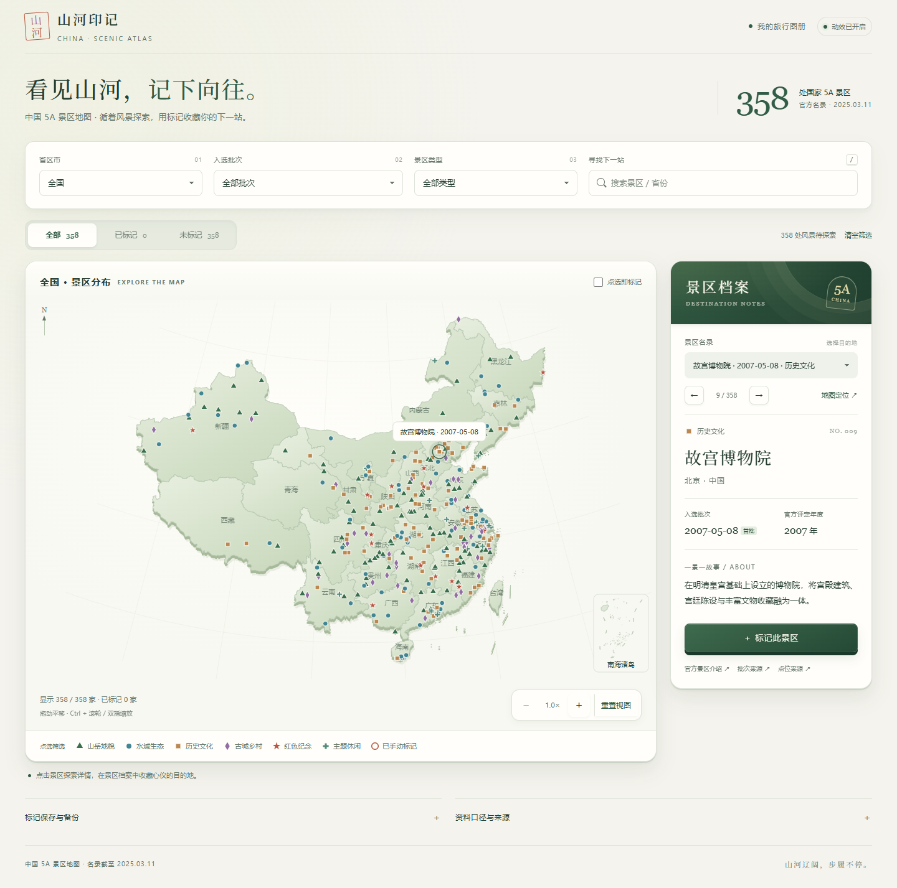

# 山河印记 · 中国 5A 景区地图

看见山河，记下向往。一个可直接离线打开的中国 5A 景区旅行图册。



## 使用

下载本仓库后，直接用现代浏览器打开 **[index.html](index.html)**。地图、358 条景区数据和 D3 均已内嵌，无需启动服务器、申请地图密钥或联网加载资源；资料来源链接需要联网访问。

- 省份、入选批次、景区类型和名称组合筛选；条件标签可单独移除。
- 搜索联想：按 `/` 开始搜索，方向键选择，Enter 定位，Esc 收起。
- 点击图例筛选类型，在景区档案中切换上一处、下一处或定位到地图。
- 手动标记、取消、撤销，以及全部／已标记／未标记筛选。
- 浏览器本地保存标记，支持 JSON 备份导出和合并导入。
- 平滑缩放、浮雕式地图、深浅主题、移动端布局与可关闭的动效。

“重置视图”只恢复当前省份的地图视角；“清空筛选”恢复全国全部景区，保留个人标记。鼠标拖动平移，Ctrl + 滚轮或双指缩放。

标记保存于当前浏览器的 localStorage，不会提交到 GitHub。更换浏览器、移动本地 HTML 文件或清理浏览器数据前，请导出备份。存储不可用时页面仍可临时标记，并会提示备份。

## 开发与构建

构建仅需要 Python 3.10+ 标准库，不依赖任何专有运行环境：

```sh
python build.py
```

开发时可运行 `python -m http.server 8000`，然后访问 `http://localhost:8000`。发布包中的 `index.html` 已构建，可单独复制使用。

```text
src/          页面结构、样式、动画和交互源码
data/         358 家景区记录及地图边界
vendor/       D3 7.9.0 及其许可证
docs/         页面预览
tests/        离线交互检查
build.py      可重复构建脚本
index.html    可直接打开的独立页面
```

## 验证

需要 Node.js 20+：

```sh
npm install
npx playwright install chromium
npm test
```

也可通过 `BROWSER_EXECUTABLE` 环境变量指定已安装的 Chrome 或 Edge。检查覆盖离线加载、筛选、标记及撤销、搜索定位、动效开关和窄屏布局。

## 数据口径与署名

名录快照截至 **2025-03-11**，原始资料核对日期为 **2026-09-16**；本项目不自动更新名录。跨省壶口瀑布计 1 家，联合景区以一个代表点显示。批次采用首次公布日期；个别评定年度与公告日期不同，已在对应景区注明。

类型是按主要旅游资源进行的编辑分类；简介为资料压缩改写；坐标用于全国和省域分布展示，不是导航入口或景区边界。景区名称、简介、批次及点位均保留来源链接。完整署名与第三方权利说明见 [THIRD_PARTY_NOTICES.md](THIRD_PARTY_NOTICES.md)。

本仓库未为原创项目代码另行授予开源许可证；第三方代码和数据按各自的许可证及来源条件使用。
